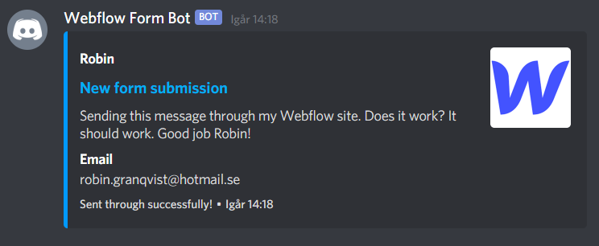

# Sending Webflow form data to a Discord channel
A simple Express.js server processing form data sent from 
Webflow through its integrated form webhook and sends it 
to a Discord channel through Discord.js.

